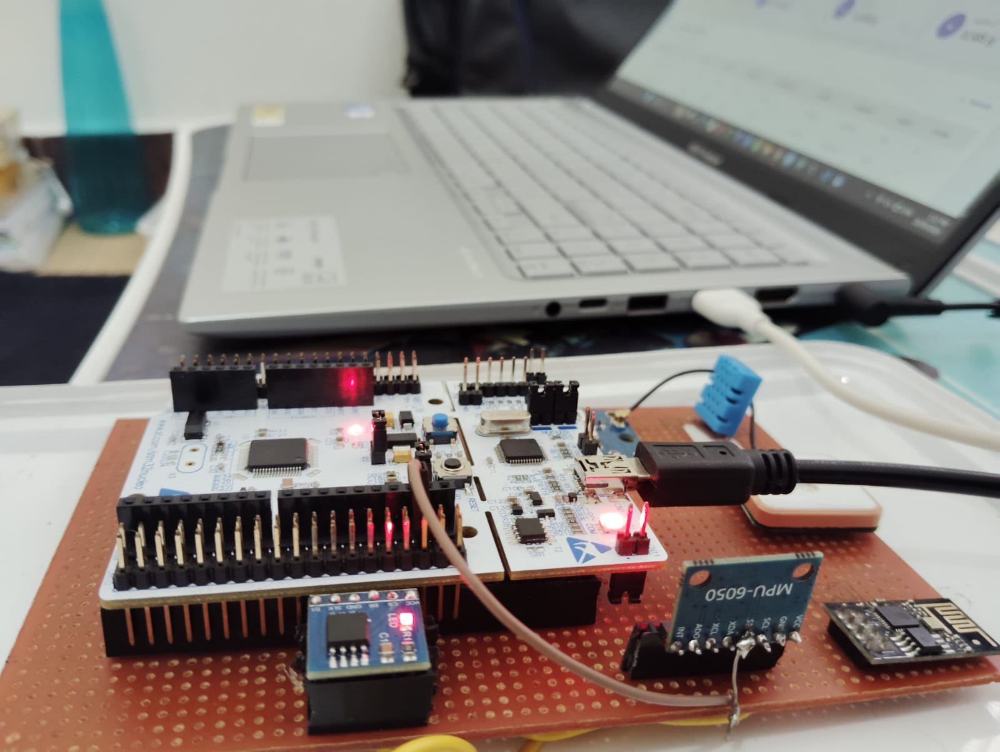
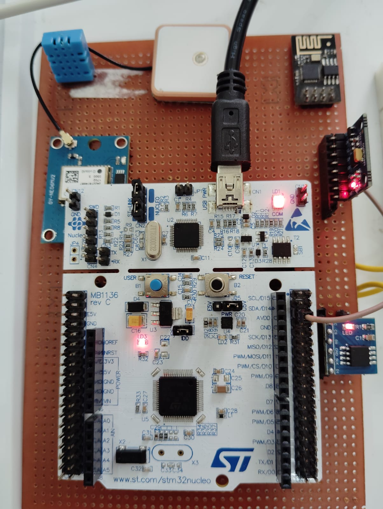
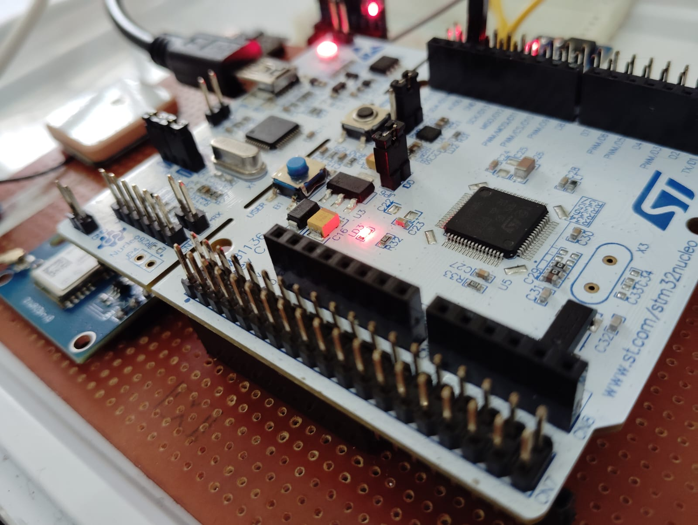
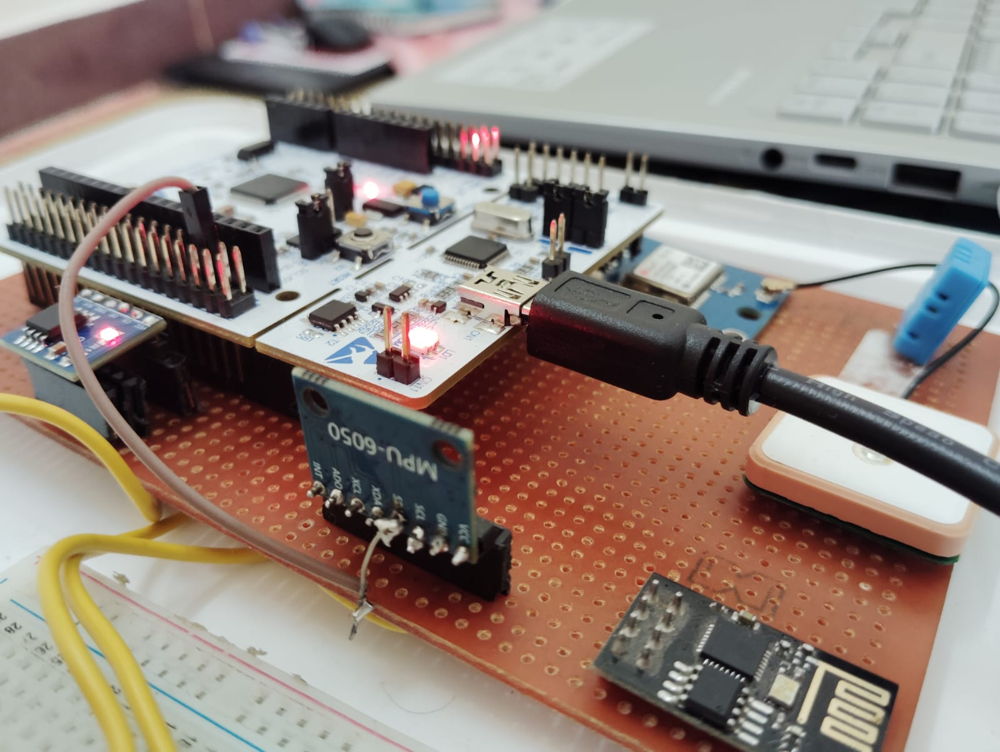

# IoT Asset Tracker

An STM32-based IoT asset tracking and monitoring system for logistics and asset-management applications.

The project combines embedded firmware, GPS tracking, motion detection, environmental sensing, local flash storage, wireless communication, MQTT telemetry, backend processing, and a web dashboard into one end-to-end IoT system.

---

## Overview

The system is designed to monitor an asset using an STM32F446RE microcontroller.

The STM32 collects data from multiple sensors and peripherals, generates structured JSON telemetry, stores telemetry locally in external SPI Flash, and sends the data to an ESP32 through UART.

The ESP01 provides Wi-Fi connectivity and forwards the telemetry to an MQTT broker.

git push
A Python Flask backend subscribes to the MQTT topic, stores telemetry in SQLite, and provides REST APIs used by the web dashboard.


### End-to-End Data Flow

```text
NEO-6M GPS ──┐
MPU6500 ─────┤
DHT11 ───────┤
W25Q64 ──────┤
             ↓
        STM32F446RE
             │
            UART
             ↓
           ESP32
             │
           Wi-Fi
             ↓
      MQTT / Mosquitto
             ↓
       Flask Backend
             ↓
          SQLite
             ↓
       Web Dashboard
Hardware
- STM32F446RE
- NEO-6M GPS
- MPU6500
- DHT11
- W25Q64 SPI Flash
- ESP01
Embedded Firmware
- GPS NMEA parsing
- MPU6500 acceleration and motion interrupt
- Heavy-motion detection
- DHT11 temperature/humidity
- W25Q64 local storage
- UART communication
- JSON telemetry generation
IoT Communication
STM32 → UART → ESP32 → Wi-Fi → MQTT
MQTT topic:
asset/ASSET001/telemetry
Backend & Dashboard
- Python
- Flask
- SQLite
- JavaScript
- HTML/CSS
- MQTT
The dashboard displays:
- GPS position
- GPS fix
- Temperature
- Humidity
- Acceleration
- Motion events
- Heavy-motion events
- Telemetry history
Project Structure
IOT-Asset-Tracker/
├── Core/
├── Drivers/
├── dashboard/
├── Tracker.ioc
├── .gitignore
└── README.md
Technologies
STM32F446RE Embedded C STM32 HAL I2C SPI UART ESP32 MQTT Flask SQLite JavaScript
## Project Photos

### Hardware Setup









### Project Demonstration

[Watch the hardware demonstration video](Media/video/Video.mp4)